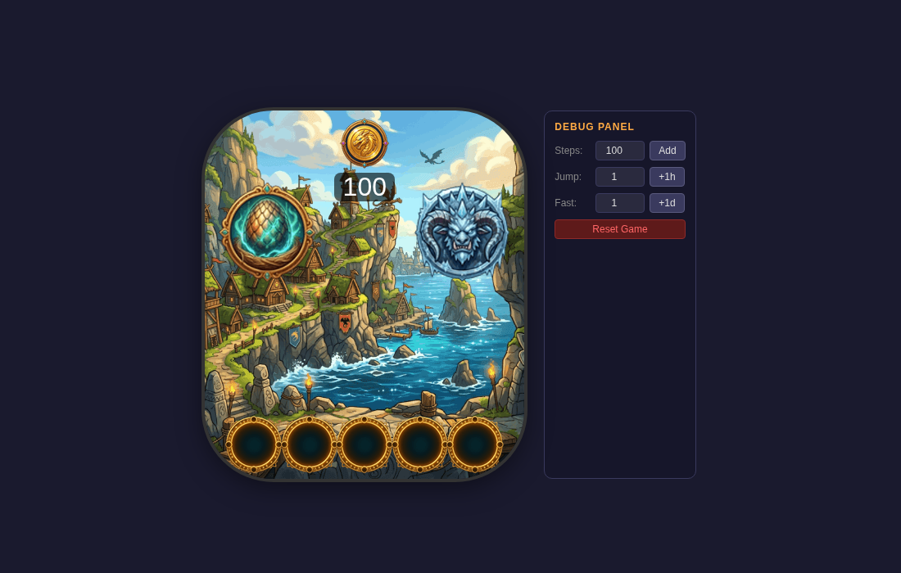

# Dragon Army

A Zepp OS / Amazfit Bip 6 pet-battler inspired by *How to Train Your Dragon*.
Hatch dragon eggs, train them, fight spawn-based monsters, and take down the
**Bewilder Beast** boss with your roster.



## How to play

1. **Buy Egg** (top-left on the main hub) — spin-then-pay: tap Reveal to freeze
   the spin, then OK to pay 100 coins. The egg hatches in 24–48h real time.
2. **Navigate by tapping** — the main hub has a bottom roster-strip of
   thumbnails; dragon detail screens return via **Home**.
   (There is no swipe navigation — it proved unreliable on the real device.)
3. **Train** a hatched dragon — costs coins (scales with strength) **and 15
   energy** per session, raises strength by +3–7.
4. **Fight monsters** — only spawned monsters (0–3) are listed. Winning gives
   coins **plus permanent strength** (Easy +1–2, Medium +2–3, Hard +3–5);
   losing costs energy, strength unchanged.
5. **Fight the Bewilder Beast** (top-right) — all hatched dragons with energy
   > 0 attack in roster order; the beast retaliates on energy. Dragons dropped
   to 0 are removed. Winning vanishes the beast for a day and grants every
   survivor **+3–5 permanent strength** plus 300 coins.
6. **Earn Coins** — hourly coins accrue but are credited only by tapping the
   coin icon when it appears. Energy recovers passively (10/hour).

## Run it

```sh
npm install
npm test                 # engine unit + balance tests (vitest)
npm run build:engine     # regenerate engine/*.js from engine/*.ts (zeus bundles .js only)
npm run dev --prefix web # web preview (watch UI + debug panel: +hours/+days, reset)
npm run build --prefix web
```

Project layout: `engine/` (pure rules: `config.ts`, `engine.ts`, `utils.ts`,
`types.ts`), `page/` (Zepp OS UI), `web/` (desktop preview),
`docs/` (`core.md`, `interface.md`, `idea.md`, screenshot).

## Balance at a glance

| Action | Cost | Reward |
|---|---|---|
| Egg | 100 coins | random of 16 breeds |
| Train | coins (8 + 0.8×str) + 15 energy | +3–7 strength |
| Monster win | 70–100 energy | coins + strength (+1–2 / +2–3 / +3–5) |
| Beast win | energy per turn (18–28 counter) | 300 coins + 3–5 strength per survivor |

## What could look better (from a playtest pass)

Playtested via engine simulation (buy → hatch → train → monster/beast fights)
plus a real render of the web preview (screenshot above). Biggest visual wins:

1. **Icon labels** — Buy Egg / Beast / Train / Sell / Danger are icon-only;
   first-time players can't tell what they do. Add 1-line labels under each.
2. **Monster names** — opponents are literally called "monster 1/2/3". Give
   them breed-style names and matching portraits (currently reuses dragon art).
3. **Egg-spin symbols** — the spin cycles placeholder glyphs (`167468123?!-+`);
   spin through mini egg/dragon icons instead.
4. **Empty roster slots** — five dark holes on a fresh game read as missing
   art; show a faint egg silhouette or "+" instead.
6. **Numbers on bars** — energy/beast HP bars have no numeric readout; add
   small `72/100`-style text for clarity on a tiny screen.
7. **Fight pacing** — beast log reveals one line per 5s with no skip; add
   tap-to-reveal-all and a victory flash + haptics.
8. **Text contrast** — white text over the bright home/ocean background is
   saved only by the dark pill; extend the pill treatment to every floating
   label (coin delta, level line).
9. **Debug panel in builds** — the side debug panel is dev-only; strip it from
   production screenshots/builds.
10. **Beast intro hierarchy** — HP bar + "N dragon(s) ready" + warning compete;
    stack as title → HP → team → warning → Fight with more breathing room.
